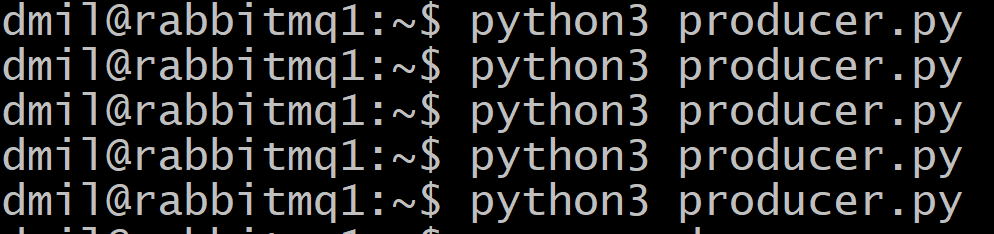

# Домашнее задание к занятию  «Очереди RabbitMQ» Илларионов Дмитрий


---

### Задание 1. Установка RabbitMQ

Используя Vagrant или VirtualBox, создайте виртуальную машину и установите RabbitMQ.
Добавьте management plug-in и зайдите в веб-интерфейс.

*Итогом выполнения домашнего задания будет приложенный скриншот веб-интерфейса RabbitMQ.*

#### Решение

Создал ВМ через терраформ в облаке, и в коде терраформ сразу указал команды для установки Rabbitmq:

```
  provisioner "remote-exec" {
    inline = [
    "sudo apt update",
    "sudo apt install -y rabbitmq-server",
    "sudo rabbitmq-plugins enable rabbitmq_management",
    "sudo rabbitmqctl add_user test passwd",
    "sudo rabbitmqctl set_user_tags test administrator",
    "sudo rabbitmqctl set_permissions -p / test \".*\" \".*\" \".*\"",
    "sudo echo \"192.168.10.10 rabbitmq1\" >> /etc/hosts",
    "sudo echo \"192.168.10.11 rabbitmq2\" >> /etc/hosts",    
    ]
  }
```

Получил ВМ в облаке с установлленным rabbitmq:


Проверил статус сервиса:


Заше на Web интерфейс:


---

### Задание 2. Отправка и получение сообщений

Используя приложенные скрипты, проведите тестовую отправку и получение сообщения.
Для отправки сообщений необходимо запустить скрипт producer.py.

Для работы скриптов вам необходимо установить Python версии 3 и библиотеку Pika.
Также в скриптах нужно указать IP-адрес машины, на которой запущен RabbitMQ, заменив localhost на нужный IP.

```shell script
$ pip install pika
```

Зайдите в веб-интерфейс, найдите очередь под названием hello и сделайте скриншот.

   

После чего запустите второй скрипт consumer.py и сделайте скриншот результата выполнения скрипта


*В качестве решения домашнего задания приложите оба скриншота, сделанных на этапе выполнения.*

Для закрепления материала можете попробовать модифицировать скрипты, чтобы поменять название очереди и отправляемое сообщение.

---

### Задание 3. Подготовка HA кластера

Используя Vagrant или VirtualBox, создайте вторую виртуальную машину и установите RabbitMQ.
Добавьте в файл hosts название и IP-адрес каждой машины, чтобы машины могли видеть друг друга по имени.

Пример содержимого hosts файла:
```shell script
$ cat /etc/hosts
192.168.0.10 rmq01
192.168.0.11 rmq02
```
После этого ваши машины могут пинговаться по имени.
Затем объедините две машины в кластер и создайте политику ha-all на все очереди.

#### Решение

Через терраформ создал две ВМ (см. код в git - файл trr/main.tf2 ).
На обоих серверах добавил в hosts:

```
192.168.10.10 rabbitmq1
192.168.10.11 rabbitmq2
```
еще добавил на обоих:

```
echo "12345" > /var/lib/rabbitmq/.erlang.cookie
```
На обоих серверах выполнил:

```
# systemctl restart rabbitmq-server.service
# systemctl status rabbitmq-server.service
```


На 2-м:
```
root@rabbitmq2:~# rabbitmqctl stop_app
root@rabbitmq2:~# rabbitmqctl reset
root@rabbitmq2:~# rabbitmqctl join_cluster rabbit@rabbitmq1
root@rabbitmq2:~# rabbitmqctl start_app 
root@rabbitmq2:~# rabbitmqctl cluster_status
```  


То что были некоторые errors - нормально.


На 1м сервере:

```
root@rabbitmq1:~# rabbitmqctl set_policy ha-all "" '{"ha-mode":"all","ha-sync-mode":"automatic"}'
```


*В качестве решения домашнего задания приложите скриншоты из веб-интерфейса с информацией о доступных нодах в кластере и включённой политикой.*


Также приложите вывод команды с двух нод:

```shell script
$ rabbitmqctl cluster_status
```


Для закрепления материала снова запустите скрипт producer.py и приложите скриншот выполнения команды на каждой из нод:

```shell script
$ rabbitmqadmin get queue='hello'
```


После чего попробуйте отключить одну из нод, желательно ту, к которой подключались из скрипта, затем поправьте параметры подключения в скрипте consumer.py на вторую ноду и запустите его.

*Приложите скриншот результата работы второго скрипта.*

На первом сервере отключил службу rabbitmq


Поправил скрипт:


На первом сервере выполнил отправку сообщений но уже на второй сервер:


В веб интерфейсе на втором сервере:


Прочитал все сообщения на второй ноде:


видно что ничего не пропало.


## Дополнительные задания (со звёздочкой*)
Эти задания дополнительные, то есть не обязательные к выполнению, и никак не повлияют на получение вами зачёта по этому домашнему заданию. Вы можете их выполнить, если хотите глубже шире разобраться в материале.

### * Задание 4. Ansible playbook

Напишите плейбук, который будет производить установку RabbitMQ на любое количество нод и объединять их в кластер.
При этом будет автоматически создавать политику ha-all.

*Готовый плейбук разместите в своём репозитории.*


#### Решение

Создал код для развертывания через терраформ:

1. Развертывается группа "пустых" ВМ, но с уникальными параметрами (ядра, память, объем диска, образ загрузки и т.п.), определенными в коде терраформ.
2. Через терраформ автоматически развертывается ВМ с Ansbil - развертывается ВМ, устанавливается Ансибл, заливается файл с плеем - play.yaml .
3. Автоматически запускается плей - play.yaml - устанавливается на остальные ВМ нужные сервисы и настраивается кластер.

После этого уже получаем готовые ВМ:


Через web интерфейс проверил - кластер работает.

Код развертывания ВМ Ansibl:

```
#---- vm Ansible --------------

resource "yandex_compute_instance" "ansible" {
  name                      = "ansible"
  hostname = "ansible"
  allow_stopping_for_update = true
  platform_id               = "standard-v1"
  #zone                      = local.zone

  resources {
    core_fraction = 100
    cores  = "2"
    memory = "2"
  }

  boot_disk {
    initialize_params {
      image_id = "fd8kb72eo1r5fs97a1ki"   #ubuntu 2204
      size = 10
    }
  }

  network_interface {
    subnet_id = "${yandex_vpc_subnet.subnet-1.id}"
    nat       = true
  }

  scheduling_policy {
  preemptible = true
   }

 metadata = {
    user-data = "${file("./meta.yaml")}" 
  }

#---------- копируем файлы ----

  provisioner "file" {
    source      = "id_ed25519"
    destination = "/root/.ssh/id_ed25519"
  }

  provisioner "file" {
    source      = "id_ed25519.pub"
    destination = "/root/.ssh/id_ed25519.pub"
  }

  provisioner "file" {
    source      = "ansible/play.yaml"
    destination = "/root/play.yaml"
  }

 provisioner "remote-exec" {
    inline = [
    "sudo apt-add-repository -y ppa:ansible/ansible",
    "sudo apt update",
    "sudo apt install -y ansible",
    "cd ",
    "sudo ansible-config init --disabled -t all > ansible.cfg",
    "echo \"[rabbitmq-cluster] \n rabbitmq[1:2] ansible_ssh_user=root \" >> /etc/ansible/hosts",
    "sudo echo \"192.168.10.10 rabbitmq1\" >> /etc/hosts",
    "sudo echo \"192.168.10.11 rabbitmq2\" >> /etc/hosts",
    "sudo chmod 600 /root/.ssh/id_ed25519",
    "ssh-keyscan -H rabbitmq1 >> /root/.ssh/known_hosts",
    "ssh-keyscan -H rabbitmq2 >> /root/.ssh/known_hosts",
    "ansible-playbook play.yaml"
    ]
  }
    connection {
      type        = "ssh"
      user        = "root"
      private_key = "${file("id_ed25519")}"
      host = self.network_interface[0].nat_ip_address
    }
}
```

Код плейбука (по хорошему нужно бы все по ролям разнести, но, пока этим не стал заниматься):

```
---
- name: Настройка кластера rabbitmq
  hosts: rabbitmq-cluster
#  vars:
#  vars_files: vars.yaml

  become: yes
  tasks:

#------- Настройки ОС ---------
  - name: Отключить автообновление
    replace:
      path: "/etc/apt/apt.conf.d/20auto-upgrades"
      regexp: '1'
      replace: '0'

  - name: Проверить часовой пояс Europe/Moscow
    community.general.timezone:
      name: Europe/Moscow

  - name: Ensure a locale exists
    community.general.locale_gen:
      name: C.UTF-8
      state: present

  - name: Update apt packages
    become: true
    apt:
      update_cache: yes
      cache_valid_time: 86400 #One day
#      upgrade: yes

#------- установка пакетов ------

  - name: "Проверить что пакеты установлены"
    apt:
      name:
        - rabbitmq-server
        - pip
        - mc
      state: present

  - name: Установить библиотеку pika
    pip:
      name:
        - pika

# --- файл hosts
  - name: добавить записи в файл hosts (вообще это не идемпотентно - нужно бы переделать может через replace)
    shell: >
      sudo echo "192.168.10.10 rabbitmq1" >> /etc/hosts &&
      sudo echo "192.168.10.11 rabbitmq2" >> /etc/hosts        

#--- настройки rabbitmq ---

  - name: enable rabbitmq plugins
    rabbitmq_plugin:
      names: rabbitmq_management,rabbitmq_tracing,rabbitmq_federation
      state: enabled
    become: yes
    become_user: rabbitmq      

  - name: ensure rabbitmq vhost / is present
    rabbitmq_vhost:
      name: /
      state: present

#------- Настройка кластера rabbitmq -----------------------------------------------

  - name: rabbitmq_clustering | ensure rabbits are stopped
    service:
      name: rabbitmq-server
      state: stopped

#  - name: rabbitmq_clustering | copy erlang cookie
#    template:
#      src: templates/erlang.cookie.j2
#      dest: /var/lib/rabbitmq/.erlang.cookie
#      owner: rabbitmq
#      group: rabbitmq
#      mode: 0400
#      backup: yes
#    no_log: True

  - name: создать файл erlang.cookie с куками
    shell: >
      sudo echo "12345" > /var/lib/rabbitmq/.erlang.cookie

  - name: rabbitmq_clustering | restarting rabbitmq-server to pick up new cookie
    service:
      name: rabbitmq-server
      state: started

  # the following 3 commands run on the secondary nodes only
  - name: rabbitmq_clustering | stopping rabbitmq app
    command: rabbitmqctl stop_app
    when: inventory_hostname != "rabbitmq1"

  - name: rabbitmq_clustering | resetting rabbitmq app
    command: rabbitmqctl reset
    when: inventory_hostname != "rabbitmq1"

  - name: rabbitmq_clustering | start rabbitmq app
    command: rabbitmqctl start_app
    when: inventory_hostname != "rabbitmq1"

  # The following commands run on the primary node
  - name: rabbitmq_clustering | stopping rabbitmq app
    command: rabbitmqctl stop_app
    when: inventory_hostname == "rabbitmq1"

    # resetting the app destroys user access
  - name: rabbitmq_clustering | resetting rabbitmq app
    command: rabbitmqctl reset
    when: inventory_hostname == "rabbitmq1"

  # while the playbook uses the primary/secondary nomenclature
  # it doesn't matter which node joins the cluster first or second...
  # we only have two nodes in this cluster. If there were more,
  # then ideally, we'd tell every secondary node to join the primary


  - name: rabbitmq_clustering | joining rabbitmq cluster
    tags: now
    command: rabbitmqctl join_cluster 'rabbit@rabbitmq2'
    register: cluster_joined
    when: inventory_hostname == "rabbitmq1"

  - name: rabbitmq_clustering | start rabbitmq app
    tags: now
    command: rabbitmqctl start_app
    when: inventory_hostname == "rabbitmq1"

  - name: rabbitmq_clustering | all the queues
    tags: now
    command: rabbitmqctl set_policy ha-all "" '{"ha-mode":"all","ha-sync-mode":"automatic"}'
    when: inventory_hostname == "rabbitmq1"

  - name: add rabbitmq user
    tags:
      - rabbitmq-users
    rabbitmq_user:
      user: "test"
      password: "passwd"
      tags: administrator,"rabbit"
      vhost: /
      configure_priv: .*
      write_priv: .*
      read_priv: .*
      state: present
    ignore_errors: yes
    when: inventory_hostname == "rabbitmq1"


#------------------------------------------------------

...

```


